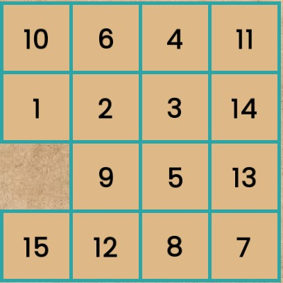
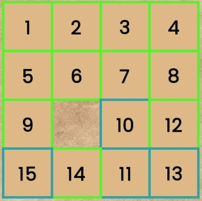

# Sliding Puzzle Game

## Overview

This project is a Sliding Puzzle Game created with C++ and SFML at the begining of my journey aiming to explore game development.

## Features

- Basic sliding puzzle functionality
- Simple and clean user interface

## Description

The goal of the Sliding Puzzle Game is to arrange the pieces in the correct order to establish a certain end-configuration. 

Below are the stages of the game:

### 1. Initial State
Pieces are disorganized.

### 2. In Progress
Player is rearranging the pieces.

### 3. Completed
Puzzle is solved!

## Current Status

- **Note**: This project is currently incomplete, and the code is not clean, but it works! It serves as a milestone in my learning process rather than a fully polished application.

## Learning Experience

This project represents an early stage in my journey as a developer. Through building this game, I gained experience in:

- C++ programming
- Using the SFML library for graphics
- Implementing game mechanics
- Problem-solving and debugging
